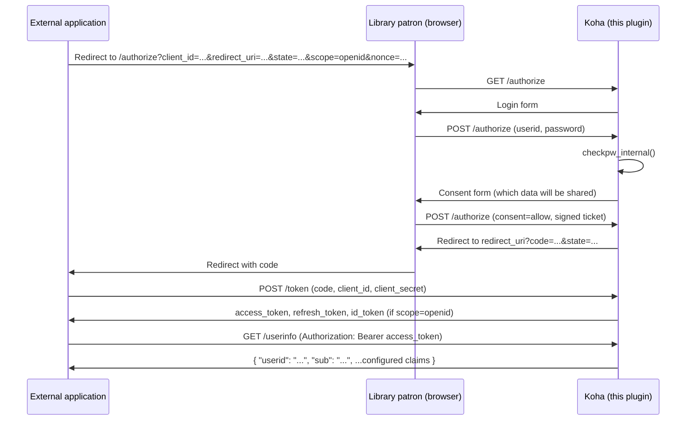

# koha-plugin-oauth-provider

Turns Koha into an **OAuth2 and OpenID Connect server**: external applications can let a
library patron log in with their Koha account and then - individually configurable per
registered application ("client") - fetch user data via a `/userinfo` endpoint, or (with
`scope=openid`) receive a signed `id_token`. By default, only the account's `userid` is
released.

`Koha::Plugin::Com::Lmscloud::OAuthProvider`

## 1. Why this architecture

Koha today has **no** OAuth server for regular user logins. There is only:

- `Koha::Auth::Client::OAuth` - Koha acting as an OAuth **client** against an external IdP
  (`/api/v1/public/oauth/login/{provider}/{interface}`). That's the opposite direction of
  what this plugin needs.
- `Koha::REST::V1::OAuth` - a very narrow client-credentials server
  (`/api/v1/oauth/token`, gated by the `RESTOAuth2ClientCredentials` system preference)
  that binds one API key to exactly **one** patron. No authorization-code flow, no
  "any user logs in with a password".

This plugin therefore builds a self-contained, complete OAuth2 authorization-code flow
from scratch, as plugin-owned REST routes under `/api/v1/contrib/oauthprovider/`.

**Confidential clients only:** every registered application gets a `client_secret`. No
public-client/mandatory-PKCE mode for SPAs - PKCE is still supported (optional, S256) as
an extra layer of defense.

**How "full" OpenID Connect works without a new dependency:** because only confidential
clients are allowed, the `id_token` can be **HS256-signed using the application's own
`client_secret` as the HMAC key**. That's spec-compliant OIDC (OIDC Core explicitly
allows HS256 via `client_secret`) and needs no asymmetric key management, no real JWKS,
no new CPAN module - `Mojo::JWT` (already vendored, `cpanfile:83`) is enough. The
trade-off: tools/libraries that insist on RS256 + JWKS won't work with it "out of the
box". A `/jwks` endpoint exists anyway (always returns an empty key set) - purely so that
discovery clients which blindly fetch `jwks_uri` don't get a 404.

One genuine trade-off that can't be solved inside the plugin itself: per spec, the OIDC
discovery document belongs at `/.well-known/openid-configuration` on the domain root, but
Koha plugin routes are always mounted under `/api/v1/contrib/<namespace>/...` (confirmed
in `Koha/REST/Plugin/PluginRoutes.pm`). See the "Full OpenID Connect" section below for
the chosen solution (a webserver rewrite, to be set up manually by an administrator).

## 2. Flow



See the comments in `Controller.pm` for details. Short version:

1. **`GET /authorize`** validates `client_id`/`redirect_uri` and shows a self-contained
   login form (no Koha chrome - see section 4). `scope` and `nonce` (if supplied by the
   client) are carried through all the way to the finished authorization code.
2. **`POST /authorize`** (stage `login`) checks the credentials via
   `C4::Auth::checkpw_internal` (allows login by either `userid` or `cardnumber`; Koha's
   own account lockout and failed-attempt tracking kicks in automatically) and then shows
   a consent form listing the data that will be shared.
3. **`POST /authorize`** (stage `consent`) verifies a short-lived (5 min), signed ticket
   (JWT via `Mojo::JWT`, HMAC secret generated once at install time) and, on approval,
   redirects to the application's `redirect_uri` with an authorization code.
4. **`POST /token`** exchanges the code (`authorization_code` grant, optionally with a
   PKCE `code_verifier`) or a refresh token (`refresh_token` grant, rotating) for an
   `access_token` + `refresh_token`, plus an `id_token` if the original `scope` included
   `openid`.
5. **`GET /userinfo`** with `Authorization: Bearer <access_token>` returns
   `{"userid": "...", "sub": "...", ...whichever extra fields are configured for that client}`.

All routes pass through Koha's REST auth layer unauthenticated (no `x-koha-authorization`
in `api_routes.json` - the same technique Koha's own `/oauth/token` endpoint uses), since
they handle their own authentication.

## 3. Available claims

Hard-coded in the plugin (`ClaimsCatalog.pm`), toggled per client via checkboxes in the
admin UI: `cardnumber`, `borrowernumber`, `firstname`, `surname`, `email`, `branchcode`,
`branchname`, `categorycode`, `category_description`, `dateexpiry`. `userid` is not a
catalog entry and is **always** released, as is `sub` (the immutable `borrowernumber`, as
a string - in case staff ever rename a `userid`, and because OIDC requires a stable `sub`
claim).

## 4. Why standalone templates instead of Koha chrome

`Koha::Plugins::Base::get_template()` is hardcoded to `type => "intranet"` and there is no
OPAC-side plugin runner. `login.tt`/`consent.tt`/`error.tt` (under `templates/`) are
therefore standalone HTML pages rendered directly via Template Toolkit, without Koha
chrome (mirroring the sibling plugin
[koha-plugin-eid-verification](../koha-plugin-eid-verification)). `configure.tt`/`tool.tt`,
by contrast, are regular intranet pages (`get_template()`, requiring staff login + the
`plugins` permission).

## 5. Bilingual UI (English/German)

`configure.tt`, `tool.tt`, `login.tt`, `consent.tt` and `error.tt` render in English or
German depending on Koha's configured interface language, with the strings being
switched. This is deliberately not real gettext: `Koha::I18N` (Koha's own runtime
translation layer) is bound to a single, fixed textdomain (`"Koha"`, pointing at Koha's
own core `.po` catalog) - a plugin's own strings are never part of that catalog, so
`[% USE I18N %]`/`t()` would just echo the source string back untranslated. Instead, this
plugin follows the lighter approach from
[Translating your plugin - KohaAdvent 2020-12-08](https://koha-community.gitlab.io/KohaAdvent/2020-12-08-translate-plugin/):
a plain per-plugin `T` string hash, selected at render time via the interface's `LANG`.

```
Koha/Plugin/Com/Lmscloud/OAuthProvider/i18n/
├── default.inc   # English (base/fallback)
└── de-DE.inc      # German
```

Every template starts with:
```
[% TRY %]
    [% PROCESS "$PLUGIN_DIR/i18n/${LANG}.inc" %]
[% CATCH %]
    [% PROCESS "$PLUGIN_DIR/i18n/default.inc" %]
[% END %]
```
and then references strings as `[% T.some_key %]` (a missing key silently renders as
empty - no error - so keep `default.inc`/`de-DE.inc` in sync by hand when adding a key).
Claim labels are looked up by a computed key (`claim_label_<claim key>`) via
`[% SET label_key = 'claim_label_' _ key %][% T.$label_key %]` - `T.${'claim_label_' _
key}` does **not** parse in Template Toolkit (confirmed by testing against a real TT
engine; string concatenation isn't allowed inside a `${...}` dot-access).

Language selection differs by page type:
- `configure.tt`/`tool.tt` run through `get_template()`
  (`C4::Auth::get_template_and_user`), which already injects `LANG` (the logged-in staff
  user's interface language, via `C4::Languages::getlanguage`) and `PLUGIN_DIR` for free
  (`Koha::Plugins::Base`) - no extra plugin code needed.
- `login.tt`/`consent.tt`/`error.tt` are unauthenticated and have no CGI/session object to
  hand to `getlanguage()`. `OAuthProvider::detect_public_language()` replicates just the
  safe, per-request-scoped parts of that logic directly against the Mojolicious request:
  `KohaOpacLanguage` cookie, then the `Accept-Language` header (via Koha's own
  `C4::Languages::accept_language` content-negotiation helper), then the library's first
  configured `OPACLanguages` value, then `en`. Deliberately **not** calling
  `C4::Languages::getlanguage()` itself here: it caches its result under one global,
  session-unaware key, which would leak one anonymous visitor's detected language onto
  another's response under a persistent Mojolicious worker handling many concurrent
  requests.

To add a third language: add `<lang-code>.inc` (see `installer/data/mysql/localization/`
in Koha core for valid codes, e.g. `fr-FR`) with the same keys as `default.inc`, and make
sure that language is enabled in the `OPACLanguages`/`language` system preferences -
nothing else needs to change.

## 6. Full OpenID Connect

Beyond plain OAuth2 (sections 1-4), the plugin supports OpenID Connect when the client
includes `scope=openid` when calling `/authorize`:

- **`nonce`**: if supplied by the client to `/authorize`, it is echoed back unchanged in
  the `id_token` (replay protection for the authentication itself, separate from the
  OAuth2 `state`). Only set on the initial `authorization_code` grant, not on a later
  `refresh_token` grant (the `nonce` belongs to the original sign-in, not to every token
  refresh).
- **`id_token`**: HS256-signed JWT (`iss`, `sub`, `aud`, `iat`, `exp`, `nonce` if present,
  `amr: ["pwd"]`, `at_hash` when issued together with an `access_token`). Deliberately
  **minimal** - the per-client-configured extra data (section 3) stays in `/userinfo`
  only, so it doesn't end up in every id_token automatically.
- **`GET /jwks`**: always returns `{"keys": []}` - there are no asymmetric keys to
  publish (HS256 with `client_secret`, see section 1). Exists only so that clients which
  blindly fetch `jwks_uri` don't get a 404.
- **`GET /.well-known/openid-configuration`**: discovery document, but under
  `/api/v1/contrib/oauthprovider/.well-known/openid-configuration` instead of the domain
  root (reason: section 1).

**Prerequisite:** under *Plugins &rarr; OAuth2 / OpenID Connect Identity Provider &rarr;
Configure*, set the **"Public base URL of this plugin"** (e.g.
`https://opac.your-library.org/api/v1/contrib/oauthprovider`). It is used as the `iss`
claim and to build every endpoint URL in the discovery document. Without a base URL set,
`scope=openid` requests won't work meaningfully (empty `iss`).

### Webserver rewrite for a real `/.well-known/openid-configuration`

For generic OIDC clients (which take the issuer hostname and automatically fetch
`<issuer>/.well-known/openid-configuration`) to work, an administrator must **manually**
set up a rewrite on the webserver **in front of** Koha. This is deliberately **not** part
of the plugin - Koha plugin routes cannot be mounted outside
`/api/v1/contrib/<namespace>/` (section 1); this can only be solved at the webserver
level.

**nginx:**
```nginx
location = /.well-known/openid-configuration {
    proxy_pass https://opac.your-library.org/api/v1/contrib/oauthprovider/.well-known/openid-configuration;
}
```

**Apache (mod_proxy):**
```apache
ProxyPass "/.well-known/openid-configuration" "https://opac.your-library.org/api/v1/contrib/oauthprovider/.well-known/openid-configuration"
```

Without this rewrite, OIDC still works - clients just need to be configured with the
plugin's own discovery URL
(`.../api/v1/contrib/oauthprovider/.well-known/openid-configuration`) instead of relying
on pure issuer auto-discovery, which most OIDC client libraries offer as an option.

## 7. Installation

1. Package this repository as a `.kpz`:
   ```bash
   zip -r koha-plugin-oauth-provider.kpz Koha/
   ```
2. Install it via the Koha staff interface under *Tools &rarr; Plugins &rarr; Upload new
   plugin* (`enable_plugins` must be enabled in `koha-conf.xml`).
3. Under *Plugins &rarr; OAuth2 / OpenID Connect Identity Provider &rarr; Configure*, set
   the "Public base URL of this plugin" (only required for OIDC/`scope=openid`, see
   section 5) and register an application. The client ID and client secret are shown -
   the secret **only once**, after that only its hash exists in the database.
4. For a real `/.well-known/openid-configuration` at the domain root: set up the
   webserver rewrite from section 5 (optional, not part of the plugin).

Because Koha plugins cannot declare their own CPAN dependencies (plugin code only runs
with modules already present on the server, see `Koha/Plugins.pm`/
`Koha/Plugins/Handler.pm`), this plugin uses exclusively modules already present in
Koha's `cpanfile` (`Mojo::JWT`, `UUID`, `Digest::SHA`, `MIME::Base64`, `Koha::AuthUtils`,
`Koha::Token`) - no extra installation needed, not even for OIDC (HS256 instead of RS256,
see section 1).

## 8. Example: token and userinfo calls

```bash
# Step 4: exchange the code for a token (assuming scope=openid at step 1)
curl -X POST https://opac.example.org/api/v1/contrib/oauthprovider/token \
  -u "<client_id>:<client_secret>" \
  -d grant_type=authorization_code \
  -d code=<code> \
  -d redirect_uri=https://app.example.org/oauth/callback
# -> {"access_token":"...","token_type":"Bearer","expires_in":3600,
#     "refresh_token":"...","id_token":"eyJ..."}

# Step 5: fetch user data
curl https://opac.example.org/api/v1/contrib/oauthprovider/userinfo \
  -H "Authorization: Bearer <access_token>"
# -> {"userid":"jdoe","sub":"42"}

# Discovery document (plugin's own URL, see section 5 for the webserver rewrite)
curl https://opac.example.org/api/v1/contrib/oauthprovider/.well-known/openid-configuration
```

## 9. Security

- `client_secret` is never stored in plaintext (bcrypt via
  `Koha::AuthUtils::hash_password`, same pattern as `Koha::ApiKey`).
- Authorization codes and access/refresh tokens are only persisted as a SHA-256 hash;
  codes are single-use with a short TTL (default 60 seconds).
- `redirect_uri` is checked for an exact match against the client's registered list (no
  wildcard, no open redirect). For an unknown client or invalid `redirect_uri`, the flow
  does **not** redirect there but shows a dedicated error page instead (RFC 6749
  4.1.2.1).
- All security-relevant data at the consent stage (`client_id`, `redirect_uri`,
  `borrowernumber`, PKCE challenge) comes exclusively from the signed login ticket, never
  from client-submitted hidden fields.
- Generated secrets/codes/tokens use only `[A-Za-z0-9]` (URL- and header-safe), rather
  than Koha's `Koha::Token` default character set.
- Prerequisite: TLS termination in front of Koha (as for any OAuth server) - not enforced
  by the plugin itself.
- `id_token`s are deliberately minimal (only the claims OIDC Core requires, plus
  `amr`/`at_hash`) - the per-client-configured extra data (section 3) is not
  automatically copied into every id_token; it stays `/userinfo`-only.
- The `id_token` signature (HS256) uses the `client_secret` the client just authenticated
  with at `/token`, in plaintext, as the key - it is not stored anywhere additionally for
  this purpose, only used in memory at the moment the token is issued.

## 10. What was NOT tested

As with the sibling plugin `koha-plugin-eid-verification`, no running Koha instance with
a database was available for this session. In particular, untested:

- The complete end-to-end flow (login &rarr; consent &rarr; token &rarr; userinfo/id_token)
  against a real Koha installation, including the `upgrade()` migration from version
  1.0.0 to 1.1.0 (`ALTER TABLE ... ADD COLUMN IF NOT EXISTS`).
- The exact return behavior of `C4::Auth::checkpw_internal` in edge cases (e.g. expired
  password, locked account) - the code assumes the confirmed normal case
  `(1, $cardnumber, $userid, $patron)` or `0` (see `C4/Auth.pm:2072-2101` in the LMSCloud
  fork); edge cases should be checked before production use.
- The rendering of `configure.tt`/`tool.tt`/`login.tt`/`consent.tt`/`error.tt` on an
  actual Koha instance (Template Toolkit syntax was only checked by code review).
- The behavior of `Mojo::JWT`'s `decode()` on expired tokens (the code assumes an expired
  `exp` claim raises an exception, which is caught via `try/catch`).
- Interoperability with concrete OIDC client libraries (e.g. whether they accept
  HS256 id_tokens without RS256/JWKS, and whether they offer a custom discovery URL
  instead of pure issuer auto-discovery), as well as the webserver rewrite itself
  (the nginx/Apache examples in section 5 are untested templates).

## 11. File overview

```
Koha/Plugin/Com/Lmscloud/
├── OAuthProvider.pm                 # Main plugin: metadata, install/upgrade/uninstall,
│                                     # client CRUD, code/token management, configure()/tool(),
│                                     # cronjob_nightly(), api_namespace/api_routes
└── OAuthProvider/
    ├── Controller.pm                 # Mojolicious controller: authorize/token/userinfo/discovery/jwks
    ├── ClaimsCatalog.pm              # Static list of allowable userinfo claims
    ├── api_routes.json               # OpenAPIv2 fragment: /authorize,/token,/userinfo,
    │                                  # /.well-known/openid-configuration,/jwks
    ├── configure.tt                  # Staff admin UI: client management
    ├── tool.tt                       # Staff tool: manual cleanup, active tokens
    ├── i18n/
    │   ├── default.inc                # English strings (base/fallback)
    │   └── de-DE.inc                   # German strings
    └── templates/
        ├── login.tt                  # Standalone login page (public, no Koha chrome)
        ├── consent.tt                 # Standalone consent page (public)
        └── error.tt                   # Standalone error page (public)
```
