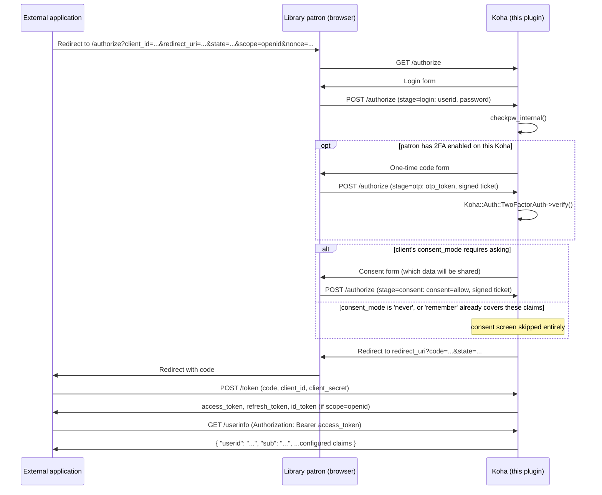

# koha-plugin-oauth-provider

Turns Koha into an **OAuth2 and OpenID Connect server (identity provider)**: external 
applications can let a library patron log in with their Koha account and then - 
individually configurable per registered application ("client") - fetch user data via a 
`/userinfo` endpoint, or (with `scope=openid`) receive a signed `id_token`. By default, 
only the account's `userid` is released.

`Koha::Plugin::Com::LMSCloud::OAuthProvider`

## 1. Why this architecture

This plugin therefore builds a self-contained, complete OAuth2 authorization-code flow
from scratch, as plugin-owned REST routes under `/api/v1/contrib/oauthprovider/`.

**Confidential clients only:** every registered application gets a `client_secret`. No
public-client/mandatory-PKCE mode for SPAs - PKCE is still supported (optional, S256) as
an extra layer of defense.

**How "full" OpenID Connect works without a new dependency:** because only confidential
clients are allowed, the `id_token` can be **HS256-signed using the application's own
`client_secret` as the HMAC key**. That's spec-compliant OIDC (OIDC Core explicitly
allows HS256 via `client_secret`) and needs no asymmetric key management, no real JWKS,
no new CPAN module - `Mojo::JWT` is enough. The trade-off: tools/libraries that insist on 
RS256 + JWKS won't work with it "out of the box". A `/jwks` endpoint exists anyway (always 
returns an empty key set) - purely so that discovery clients which blindly fetch 
`jwks_uri` don't get a 404.

One genuine trade-off that can't be solved inside the plugin itself: per spec, the OIDC
discovery document belongs at `/.well-known/openid-configuration` on the domain root, but
Koha plugin routes are always mounted under `/api/v1/contrib/<namespace>/...` (confirmed
in `Koha/REST/Plugin/PluginRoutes.pm`). See the "Full OpenID Connect" section below for
the chosen solution (a webserver rewrite, to be set up manually by an administrator).

## 2. Flow



See the comments in `Controller.pm` for details. Short version:

1. **`GET /authorize`** validates `client_id`/`redirect_uri` and shows a self-contained
   login form (no Koha chrome - see section 8). `scope` and `nonce` (if supplied by the
   client) are carried through all the way to the finished authorization code.
2. **`POST /authorize`** (stage `login`) checks the credentials via
   `C4::Auth::checkpw_internal` (allows login by either `userid` or `cardnumber`; Koha's
   own account lockout and failed-attempt tracking kicks in automatically).
3. **`POST /authorize`** (stage `otp`, only if the patron has 2FA enabled - section 6)
   verifies a one-time code via `Koha::Auth::TwoFactorAuth`, gated by the same kind of
   signed ticket as the consent step.
4. Depending on the client's **consent mode** (section 5), either a consent form listing
   the data that will be shared is shown next, or it's skipped entirely and the flow goes
   straight to issuing a code.
5. **`POST /authorize`** (stage `consent`, if shown) verifies a short-lived (5 min),
   signed ticket (JWT via `Mojo::JWT`, HMAC secret generated once at install time) and, on
   approval, redirects to the application's `redirect_uri` with an authorization code.
6. **`POST /token`** exchanges the code (`authorization_code` grant, optionally with a
   PKCE `code_verifier`) or a refresh token (`refresh_token` grant, rotating) for an
   `access_token` + `refresh_token` (lifetimes configurable, section 7), plus an
   `id_token` if the original `scope` included `openid`.
7. **`GET /userinfo`** with `Authorization: Bearer <access_token>` returns
   `{"userid": "...", "sub": "...", ...whichever extra fields are configured for that
   client}` - **see section 12 for a Koha core limitation that must be patched around for
   this call to work at all when the relying party is itself a Koha instance.**

None of this plugin's routes declare `x-koha-authorization` in `api_routes.json` - the
same technique Koha's own `/oauth/token` endpoint uses - since they all handle their own
authentication. That's necessary but not sufficient for `/userinfo` specifically: see
section 12 for a Koha core behavior that intercepts its `Authorization: Bearer` header
before the route is even reached, unless patched around.

## 3. Available claims

Each client has a configurable list of claims, managed as a table in the admin UI: every 
entry has a **type** - `field` (one of the patron fields listed below, from `ClaimsCatalog.pm`), 
`attribute` (any configured Koha extended patron attribute, by code) or `static` (a fixed 
value, not derived from the patron at all) - plus an admin-editable **claim name**, the 
actual key the value is released under in `/userinfo`. Claim names default to the field 
key/attribute code but can be renamed freely, and must be unique within a client (enforced 
both in the UI and server-side).

Built-in `field` catalog: `cardnumber`, `borrowernumber`, `firstname`, `surname`, `email`,
`branchcode`, `branchname`, `categorycode`, `category_description`, `dateexpiry`,
`dateofbirth`, `age`, `address`, `phone_number`, `mobile`, `sex`, `flags` (this patron's
own userflags bitmask on *this* Koha - not to be confused with granting permissions on a
relying party), `lang`, `fsk`, `status`. `userid` is not a catalog entry and is **always**
released, as is `sub` (the immutable `borrowernumber`, as a string - in case staff ever
rename a `userid`, and because OIDC requires a stable `sub` claim).

`age` is computed via `Koha::Patron::get_age` (years as of today, derived from
`dateofbirth`) and is released as `null` if the patron has no date of birth on file.

### `address` (OIDC Core "address" Claim)

Structured exactly per [OIDC Core 5.1.1](https://openid.net/specs/openid-connect-core-1_0.html#AddressClaim)
rather than as flat top-level fields, so OIDC-aware clients that already know how to read
a standard `address` claim need no special-casing for this plugin:

```json
"address": {
  "street_address": "Musterstrasse 1\nHinterhaus",
  "locality": "Musterstadt",
  "region": "NRW",
  "postal_code": "12345",
  "country": "Germany",
  "formatted": "Musterstrasse 1\nHinterhaus\n12345 Musterstadt\nGermany"
}
```

Mapped from Koha's **base/home** address fields only (`address`, `address2` &rarr;
`street_address`, newline-joined; `city` &rarr; `locality`; `state` &rarr; `region`;
`zipcode` &rarr; `postal_code`; `country` &rarr; `country`) - deliberately not the
alternate/"B_" address Koha also has, since OIDC's `address` claim models a single
address, not two. Every member is omitted individually when empty (all members are
optional per spec); if the patron has no address information at all, the whole `address`
claim is `null` rather than an empty object. `scopes_supported` in the discovery document
(section 11) lists `address` alongside `openid`/`profile` for OIDC client libraries that
inspect it, but that's informational only, like the other two: what's actually released
is governed purely by this per-client admin configuration, same as every other claim in
this plugin - the `scope` a client requests at `/authorize` is otherwise unused for claim
selection (it's only inspected for the literal value `openid`, to decide whether to also
issue a signed `id_token` - see section 11).

### `phone_number` / `mobile` (OIDC "phone" scope)

`phone_number` maps to Koha's primary phone field (`Koha::Patron::phone` - **not**
`mobile` or `phonepro`). `mobile` maps to `Koha::Patron::mobile` directly, for clients
that specifically need the mobile number. `scopes_supported` in the discovery document
(section 11) lists `phone` alongside the others for the same informational-only reason
described above for `address`.

### `attribute`-type claims (Koha extended patron attributes)

Any configured extended patron attribute (`Administration &rarr; Patron attribute
types`) can be released under a client-chosen claim name, picked by its attribute code
in the admin UI's "Add claim" modal. Repeatable attribute types release a JSON array of
all the patron's values for that code; non-repeatable ones release a single value (or
`null` if the patron has none on file).

### `static`-type claims (fixed values)

A claim entry can also be a fixed value that isn't derived from the patron at all -
useful for e.g. telling a relying party which IdP/environment a token came from. Every
patron authenticating through that client gets the same value.

### `fsk` and `status` (LMSCloud "Onleihe"/divibib patron status - reimplemented, no fork dependency)

These two fields return data required by the German library e-lending service 
**divibib "Onleihe"**. 

`fsk` is a German age-rating tier, derived from `Koha::Patron::get_age`:

| age range     | `fsk` |
|----------------|-------|
| 0 &ndash; 5    | `0`   |
| 6 &ndash; 11   | `6`   |
| 12 &ndash; 15  | `12`  |
| 16 &ndash; 17  | `16`  |
| 18+ or unknown | `18`  |

`status` tells the client whether - and why not - the patron may currently borrow
digital media. The checks run **in this exact order** and stop at the first match
(kept in sync by hand with `C4/External/DivibibPatronStatus.pm` in the LMSCloud fork):

| order | condition                                                           | `status` |
|-------|---------------------------------------------------------------------|----------|
| 1     | has overdues and `OverduesBlockCirc` is `block` or `confirmation`   | `1`      |
| 2     | debarred/restricted (`is_debarred`)                                 | `1`      |
| 3     | account expired (`is_expired`)                                      | `-3`     |
| 4     | no valid address on file (`gonenoaddress`)                          | `1`      |
| 5     | card marked lost (`lost`)                                           | `1`      |
| 6     | outstanding fines exceed the `noissuescharge` threshold             | `4`      |
| 7     | account locked (too many failed login attempts, `account_locked`)   | `1`      |
| -     | none of the above apply                                             | `3`      |

The codes `-2` (wrong password), `-1` (wrong credentials) and `0`/`2` (deleted/test
account) are **not reachable** here at all. 

The status `-4` ("patron category blocked") is **also not reachable** here, for a
different reason: that check has been replaced entirely by a per-client access-control
gate at `/authorize` rather than an informational claim value - see section 4. A patron
whose category isn't eligible for a given client never gets an `access_token` for it in
the first place, so there is nothing left for `status` to report in that case.

`fsk`/`status` are computed via one shared internal call regardless of whether one or
both are requested for a given client, since the underlying checks involve several DB
lookups (account charges, overdues, debarred/expired) that would otherwise run twice for
no reason.

## 4. Per-client patron category access control

This is a per-client, admin-configurable pair of patron category lists, set per 
application under *Plugins &rarr; OAuth2 / OpenID Connect Identity Provider &rarr; Configure*:

- **Allowed patron categories** (optional): if any are checked, only patrons in one of
  these categories can successfully log in for *that* client. Leaving all unchecked
  means every category is accepted (the default - matches how every other
  claim-selection list in this plugin defaults to "nothing extra configured" rather than
  "nothing allowed").
- **Denied patron categories** (optional): patrons in a checked category are always
  rejected for that client, even if their category is also checked in the allow-list
  above (deny wins on overlap, so admins can carve out an exception from an otherwise
  broad allow-list).

Unlike the claims in section 3, this is a **hard gate on the login itself**, checked in
`Controller::_handle_login` right after `checkpw_internal` succeeds (i.e. once the
patron's identity - and therefore their category - is actually known) and before a
consent screen or authorization code is ever produced. A rejected patron is redirected
straight back to the client's `redirect_uri` with `error=access_denied&state=...` - the
same outcome as a patron clicking "Deny" on the consent screen - rather than shown a
Koha-branded error page, since `redirect_uri` is already trusted by that point in the
flow (see the redirect-vs-error-page reasoning in section 15). External applications that
already handle a user declining consent therefore need no special-casing to also handle
a category-based rejection.

`OAuthProvider::is_client_allowed_for_patron($client, $patron)` implements the check
against the client's `allowed_categories`/`denied_categories` (both JSON arrays of
category codes, sanitized against `Koha::Patron::Categories` on save so a hand-crafted
POST can't smuggle in a nonexistent code).

## 5. Consent management

Each client has a **consent mode**, set under *Plugins &rarr; ... &rarr; Configure*:

- **Always ask** (default): the consent screen is shown on every single login.
- **Ask once, remember the decision**: the first successful login for a given
  (client, patron) pair shows the consent screen as usual; on `allow`, the exact set of
  claim names granted is persisted (`OAuthProvider::remember_consent`, a dedicated table
  keyed on client + `borrowernumber`). Later logins skip the consent screen **as long as**
  the client's *currently configured* claims are already covered by that stored grant. If
  an admin later widens the client's claim list, the patron sees the consent screen again
  on their very first login after that change - shrinking the claim list never triggers a
  fresh prompt, since the patron already agreed to release a superset once.
- **Never ask (trusted client)**: the consent screen is always skipped, no grant is
  persisted (there is nothing to remember). Intended for first-party/trusted
  integrations - e.g. another Koha instance within the same organization - where the
  claims released are effectively already governed entirely by the admin-side client
  configuration, not by an end-user decision per login.

`Controller::_proceed_after_authentication` implements the skip/show decision;
`OAuthProvider::consent_covers`/`remember_consent`/`forget_consent` manage the persisted
grants for "remember" mode.

## 6. Two-factor authentication

If a patron has 2FA enabled on **this** Koha (i.e. `TwoFactorAuthentication` is not
`disabled` and the patron has completed enrollment - has a `secret` on file), logging in
through this plugin also requires a one-time code, exactly as Koha's own staff login
would. This is deliberately re-implemented here rather than reused: this plugin never
goes through `C4::Auth::checkauth()`'s session-based login flow at all (see section 8),
so Koha's built-in 2FA check - itself only wired into that same session-based flow, and
only for the staff interface - would otherwise be silently bypassed entirely, letting a
patron who set up 2FA specifically to harden their account authenticate through this
plugin with just their password.

`Controller::_patron_requires_2fa` decides whether the challenge applies;
`Koha::Auth::TwoFactorAuth` (the same class Koha's core login uses) verifies the
submitted code against the patron's TOTP secret. Not implemented: Koha's "enforced" mode,
which additionally *forces* not-yet-enrolled patrons through 2FA setup (QR code
enrollment) before they can log in anywhere - that needs an enrollment UI this plugin
doesn't have. This only covers accounts where 2FA is already active.

## 7. Token lifetimes

Access/refresh token lifetimes (in seconds) have a plugin-wide default, configurable
under *Plugins &rarr; ... &rarr; Configure &rarr; General settings*, with an optional
per-client override (leave empty to inherit the global default) alongside each
application's other settings. `OAuthProvider::effective_ttls($client)` resolves which
value actually applies for a given client at token-issuance time; the same resolved
`access_ttl` is also used for the `id_token`'s `exp` claim, so it never claims a
different validity period than the access token it accompanies.

Authorization codes have their own, much shorter, fixed lifetime (60 seconds, not
admin-configurable) - refresh tokens are rotated on every use (the old one is revoked the
moment a new pair is issued from it), which matters more for limiting the blast radius of
a leaked refresh token than a short TTL would on its own.

## 8. Why standalone templates instead of Koha chrome

`Koha::Plugins::Base::get_template()` is hardcoded to `type => "intranet"` and there is no
OPAC-side plugin runner. `login.tt`/`otp.tt`/`consent.tt`/`error.tt` (under `templates/`)
are therefore standalone HTML pages rendered directly via Template Toolkit, without Koha
chrome (mirroring the sibling plugin
[koha-plugin-eid-verification](../koha-plugin-eid-verification)). `configure.tt`/`tool.tt`,
by contrast, are regular intranet pages (`get_template()`, requiring staff login + the
`plugins` permission).

## 9. Customizing the public pages (global template overrides)

Each of the four standalone pages from section 8 - `login.tt`, `otp.tt`, `consent.tt`,
`error.tt` - can be **fully overridden**, plugin-wide, under *Plugins &rarr; OAuth2 /
OpenID Connect Identity Provider &rarr; Configure &rarr; General settings &rarr;
Customize pages*. Each page has its own modal with a single textarea containing its
complete HTML/Template-Toolkit source, pre-filled with the bundled version the first time
it's opened (so an admin edits a known-working copy rather than starting blank), plus a
"Reset to default" action that clears the override and reverts to the bundled file.

Deliberately **global, not per-client**: unlike claims (section 3) or consent mode
(section 5), these pages are shown before - or independently of - which client is
involved (the error page in particular can be reached without a client ever being
identified), and the one piece of per-client wording they do need (the application name
on `login.tt`/`consent.tt`) already comes through the normal template variables, not
through a different template file per client.

**Storage:** an override is just another value in the plugin's own settings blob
(`OAuthProvider::save_custom_template` &rarr; `save_settings`), i.e. one row per plugin in
Koha's generic `plugin_data` table (`plugin_class` = this plugin, `plugin_key` =
`'settings'`), alongside `issuer_url` and the token-lifetime defaults - not a separate
table, and not a file on disk. An empty override means "use the bundled
`templates/<file>.tt` as-is"; `OAuthProvider::render_standalone_template` checks for a
non-empty override for the requested file and, if present, processes it as an in-memory
Template Toolkit string (`$tt->process(\$custom_html, ...)`) instead of the bundled file
path - the same `Template` instance/settings either way, so an override can rely on
anything the bundled templates rely on (e.g. `[% PROCESS "$PLUGIN_DIR/i18n/${LANG}.inc" %]`
for translated strings).

**Security note:** `ABSOLUTE => 1` (needed for that i18n `PROCESS`, see section 10) stays
enabled for custom sources too, rather than being hardened away for this admin-supplied
HTML - so a custom template could, in principle, `[% INCLUDE %]`/`[% PROCESS %]` an
arbitrary absolute path on the server. This was a deliberate trade-off, not an oversight:
reaching this configuration screen already requires the `plugins` permission, which lets
staff upload an entirely new plugin with unrestricted Perl execution anyway - a hardened,
separate `Template` instance for this one feature would not meaningfully shrink what such
a user could already do.

**The real risk in practice is a broken login flow, not a security one:** each of the
four pages' forms must keep specific hidden fields with specific names for the OAuth2
flow to keep working at all (e.g. `login.tt` needs `stage`, `client_id`, `redirect_uri`,
`state`, `scope`, `code_challenge`, `code_challenge_method`, `nonce`, plus visible
`userid`/`password` fields) - the admin UI states the exact requirement for each page next
to its editor, but doesn't validate it, so a custom template missing one of these breaks
the login flow for every client, silently, until an admin notices and either fixes it or
resets to default.

## 10. Bilingual UI (English/German)

`configure.tt`, `tool.tt`, `login.tt`, `consent.tt` and `error.tt` render in English or
German depending on Koha's configured interface language, with the strings being
switched. This is deliberately not real gettext: `Koha::I18N` (Koha's own runtime
translation layer) is bound to a single, fixed textdomain (`"Koha"`, pointing at Koha's
own core `.po` catalog) - a plugin's own strings are never part of that catalog, so
`[% USE I18N %]`/`t()` would just echo the source string back untranslated. Instead, this
plugin follows the lighter approach from
[Translating your plugin - KohaAdvent 2020-12-08](https://koha-community.gitlab.io/KohaAdvent/2020-12-08-translate-plugin/):
a plain per-plugin `T` string hash, selected at render time via the interface's `LANG`.

```
Koha/Plugin/Com/LMSCloud/OAuthProvider/i18n/
├── default.inc   # English (base/fallback)
└── de-DE.inc      # German
```

Every template starts with:
```
[% TRY %]
    [% PROCESS "$PLUGIN_DIR/i18n/${LANG}.inc" %]
[% CATCH %]
    [% PROCESS "$PLUGIN_DIR/i18n/default.inc" %]
[% END %]
```
and then references strings as `[% T.some_key %]` (a missing key silently renders as
empty - no error - so keep `default.inc`/`de-DE.inc` in sync by hand when adding a key).
Claim labels are looked up by a computed key (`claim_label_<claim key>`) via
`[% SET label_key = 'claim_label_' _ key %][% T.$label_key %]` - `T.${'claim_label_' _
key}` does **not** parse in Template Toolkit (confirmed by testing against a real TT
engine; string concatenation isn't allowed inside a `${...}` dot-access).

Language selection differs by page type:
- `configure.tt`/`tool.tt` run through `get_template()`
  (`C4::Auth::get_template_and_user`), which already injects `LANG` (the logged-in staff
  user's interface language, via `C4::Languages::getlanguage`) and `PLUGIN_DIR` for free
  (`Koha::Plugins::Base`) - no extra plugin code needed.
- `login.tt`/`consent.tt`/`error.tt` are unauthenticated and have no CGI/session object to
  hand to `getlanguage()`. `OAuthProvider::detect_public_language()` replicates just the
  safe, per-request-scoped parts of that logic directly against the Mojolicious request:
  `KohaOpacLanguage` cookie, then the `Accept-Language` header (via Koha's own
  `C4::Languages::accept_language` content-negotiation helper), then the library's first
  configured `OPACLanguages` value, then `en`. Deliberately **not** calling
  `C4::Languages::getlanguage()` itself here: it caches its result under one global,
  session-unaware key, which would leak one anonymous visitor's detected language onto
  another's response under a persistent Mojolicious worker handling many concurrent
  requests.

To add a third language: add `<lang-code>.inc` (see `installer/data/mysql/localization/`
in Koha core for valid codes, e.g. `fr-FR`) with the same keys as `default.inc`, and make
sure that language is enabled in the `OPACLanguages`/`language` system preferences -
nothing else needs to change.

## 11. Full OpenID Connect

Beyond plain OAuth2 (sections 1-7), the plugin supports OpenID Connect when the client
includes `scope=openid` when calling `/authorize`:

- **`nonce`**: if supplied by the client to `/authorize`, it is echoed back unchanged in
  the `id_token` (replay protection for the authentication itself, separate from the
  OAuth2 `state`). Only set on the initial `authorization_code` grant, not on a later
  `refresh_token` grant (the `nonce` belongs to the original sign-in, not to every token
  refresh).
- **`id_token`**: HS256-signed JWT (`iss`, `sub`, `aud`, `iat`, `exp`, `nonce` if present,
  `amr: ["pwd"]`, `at_hash` when issued together with an `access_token`). Deliberately
  **minimal** - the per-client-configured extra data (section 3) stays in `/userinfo`
  only, so it doesn't end up in every id_token automatically.
- **`GET /jwks`**: always returns `{"keys": []}` - there are no asymmetric keys to
  publish (HS256 with `client_secret`, see section 1). Exists only so that clients which
  blindly fetch `jwks_uri` don't get a 404.
- **`GET /.well-known/openid-configuration`**: discovery document, but under
  `/api/v1/contrib/oauthprovider/.well-known/openid-configuration` instead of the domain
  root (reason: section 1).

**Prerequisite:** under *Plugins &rarr; OAuth2 / OpenID Connect Identity Provider &rarr;
Configure*, set the **"Public base URL of this plugin"** (e.g.
`https://opac.your-library.org/api/v1/contrib/oauthprovider`). It is used as the `iss`
claim and to build every endpoint URL in the discovery document. Without a base URL set,
`scope=openid` requests won't work meaningfully (empty `iss`).

### Webserver rewrite for a real `/.well-known/openid-configuration`

For generic OIDC clients (which take the issuer hostname and automatically fetch
`<issuer>/.well-known/openid-configuration`) to work, an administrator must **manually**
set up a rewrite on the webserver **in front of** Koha. This is deliberately **not** part
of the plugin - Koha plugin routes cannot be mounted outside
`/api/v1/contrib/<namespace>/` (section 1); this can only be solved at the webserver
level.

**nginx:**
```nginx
location = /.well-known/openid-configuration {
    proxy_pass https://opac.your-library.org/api/v1/contrib/oauthprovider/.well-known/openid-configuration;
}
```

**Apache (mod_proxy):**
```apache
ProxyPass "/.well-known/openid-configuration" "https://opac.your-library.org/api/v1/contrib/oauthprovider/.well-known/openid-configuration"
```

Without this rewrite, OIDC still works - clients just need to be configured with the
plugin's own discovery URL
(`.../api/v1/contrib/oauthprovider/.well-known/openid-configuration`) instead of relying
on pure issuer auto-discovery, which most OIDC client libraries offer as an option.

## 12. Known limitation: `/userinfo` requires a small Koha core patch

**`GET /userinfo` does not work out of the box** on the Koha instance hosting this
plugin, for *any* caller, regardless of what OAuth2/OIDC client library is used. This was
found and root-caused the hard way against real Koha instances and is not specific to
this plugin's own code.

**Cause:** every `/api/v1/...` request on a Koha instance passes through
`Koha::REST::V1::Auth::authenticate_api_request`. If the request carries an
`Authorization: Bearer ...` header - which is exactly how `/userinfo` must be called, per
RFC 6750 - Koha unconditionally tries to validate that token against **its own**,
completely unrelated OAuth2 API-key mechanism (`Koha::ApiKeys` /
`Net::OAuth2::AuthorizationServer`), and throws `401 Unauthorized` immediately on
mismatch - *before* any plugin route/controller is ever reached. This happens
irrespective of the route's namespace (`/api/v1/contrib/...` plugin routes are not
exempted) and irrespective of who's calling: Koha's own OIDC client, curl, or any other
library:

```perl
if ($authorization_header and $authorization_header =~ /^Bearer /) {
    # attempt to use OAuth2 authentication
    ...
    if ($valid_token) { ... }
    else {
        # If we have "Authorization: Bearer" header and oauth authentication
        # failed, do not try other authentication means
        Koha::Exceptions::Authentication::Required->throw( error => 'Authentication failure.' );
    }
}
```
(`Koha/REST/V1/Auth.pm`)

**Fix applied on our own IdP-hosting instances:** a small, opt-in core patch adds an
early exemption, checked *before* any Bearer-header handling, for routes that declare
`"x-plugin-owns-auth": true` in their `api_routes.json` operation (this plugin's
`/userinfo` GET operation does):

```perl
# in Koha::REST::V1::Auth::authenticate_api_request, right after $spec is resolved
if ( $params->{is_plugin} && $spec->{'x-plugin-owns-auth'} ) {
    validate_query_parameters( $c, $spec );
    return 1;
}
```

This is a narrow, additive, opt-in change: routes/plugins that don't set the new flag
keep their exact current behavior (including any plugin that deliberately relies on
Koha's own Bearer-token/API-key auth for its own routes). It needs to be applied only to
the Koha instance(s) **hosting this plugin** (acting as the IdP) - not to relying-party
Koha instances that merely call out to `/userinfo` as a client.

**Without this patch, `/userinfo` cannot be used at all**, by any client - the `id_token`
stays deliberately minimal regardless (section 11), so it is not an alternative source
for the per-client-configured claims (section 3) for OIDC clients either. A **pure OAuth2
client that never requests `openid`** is affected most severely: it never receives an
`id_token` in the first place, so `/userinfo` is its *only* possible source of claims -
without this patch, such a client can authenticate a patron but never learn anything else
about them. Applying this patch (or an equivalent core fix) on the IdP-hosting instance
is therefore effectively **required** for this plugin to be useful beyond bare
authentication.

## 13. Installation

1. Package this repository as a `.kpz`:
   ```bash
   zip -r koha-plugin-oauth-provider.kpz Koha/
   ```
2. Install it via the Koha staff interface under *Tools &rarr; Plugins &rarr; Upload new
   plugin* (`enable_plugins` must be enabled in `koha-conf.xml`).
3. Under *Plugins &rarr; OAuth2 / OpenID Connect Identity Provider &rarr; Configure*, set
   the "Public base URL of this plugin" (only required for OIDC/`scope=openid`, see
   section 11) and register an application: name, redirect URIs, which claims it may
   receive (section 3), consent mode (section 5), and optionally which patron categories
   may/may not authenticate for it at all (section 4). The client ID and client secret
   are shown - the secret **only once**, after that only its hash exists in the database.
4. **Apply the core patch from section 12** on this same Koha instance - without it,
   `/userinfo` cannot be called at all, by any client.
5. Optionally, under the same *Configure* page's *Customize pages* section, override the
   login/otp/consent/error pages' HTML (section 9) - not needed for a working setup, the
   bundled pages work as-is.
6. For a real `/.well-known/openid-configuration` at the domain root: set up the
   webserver rewrite from section 11 (optional, not part of the plugin).

Because Koha plugins cannot declare their own CPAN dependencies (plugin code only runs
with modules already present on the server, see `Koha/Plugins.pm`/
`Koha/Plugins/Handler.pm`), this plugin uses exclusively modules already present in
Koha's `cpanfile` (`Mojo::JWT`, `UUID`, `Digest::SHA`, `MIME::Base64`, `Koha::AuthUtils`,
`Koha::Token`) - no extra installation needed, not even for OIDC (HS256 instead of
RS256, see section 1) or for the `fsk`/`status` claims (deliberately reimplemented
instead of depending on the LMSCloud-fork-only `C4::External::DivibibPatronStatus` - see
section 3).

## 14. Example: token and userinfo calls

```bash
# Step 4: exchange the code for a token (assuming scope=openid at step 1)
curl -X POST https://opac.example.org/api/v1/contrib/oauthprovider/token \
  -u "<client_id>:<client_secret>" \
  -d grant_type=authorization_code \
  -d code=<code> \
  -d redirect_uri=https://app.example.org/oauth/callback
# -> {"access_token":"...","token_type":"Bearer","expires_in":3600,
#     "refresh_token":"...","id_token":"eyJ..."}

# Step 5: fetch user data - requires the core patch from section 12 to be applied,
# otherwise Koha's own REST auth layer rejects this with 401 before it ever reaches
# the plugin (see section 12 for why)
curl https://opac.example.org/api/v1/contrib/oauthprovider/userinfo \
  -H "Authorization: Bearer <access_token>"
# -> {"userid":"jdoe","sub":"42"}

# Discovery document (plugin's own URL, see section 11 for the webserver rewrite)
curl https://opac.example.org/api/v1/contrib/oauthprovider/.well-known/openid-configuration
```

## 15. Security

- `client_secret` is never stored in plaintext (bcrypt via
  `Koha::AuthUtils::hash_password`, same pattern as `Koha::ApiKey`).
- Authorization codes and access/refresh tokens are only persisted as a SHA-256 hash;
  codes are single-use with a short TTL (default 60 seconds).
- `redirect_uri` is checked for an exact match against the client's registered list (no
  wildcard, no open redirect). For an unknown client or invalid `redirect_uri`, the flow
  does **not** redirect there but shows a dedicated error page instead (RFC 6749
  4.1.2.1).
- All security-relevant data at the consent stage (`client_id`, `redirect_uri`,
  `borrowernumber`, PKCE challenge) comes exclusively from the signed login ticket, never
  from client-submitted hidden fields.
- Generated secrets/codes/tokens use only `[A-Za-z0-9]` (URL- and header-safe), rather
  than Koha's `Koha::Token` default character set.
- Prerequisite: TLS termination in front of Koha (as for any OAuth server) - not enforced
  by the plugin itself.
- `id_token`s are deliberately minimal (only the claims OIDC Core requires, plus
  `amr`/`at_hash`) - the per-client-configured extra data (section 3) is not
  automatically copied into every id_token; it stays `/userinfo`-only.
- The `id_token` signature (HS256) uses the `client_secret` the client just authenticated
  with at `/token`, in plaintext, as the key - it is not stored anywhere additionally for
  this purpose, only used in memory at the moment the token is issued.
- A patron with 2FA enabled on the IdP's Koha (section 6) cannot fully authenticate
  through this plugin with just their password - the same one-time-code challenge Koha's
  own staff login would require is enforced here too.

## 16. What has been tested, and known remaining gaps

Unlike when this plugin was first written, the full flow has since been exercised against
**real, separately hosted Koha instances** acting as both IdP (running this plugin) and
relying party (Koha's own built-in OIDC/OAuth2 client) - across multiple Koha versions. That process surfaced and fixed a number of real issues that couldn't have been
found by code review alone, among them: the exact `redirect_uri` string a relying party's
OIDC client actually sends (including reverse-proxy/mount-prefix quirks in
`url_for('current')` vs `req->url->path`), `identity_provider_domains` catch-all/wildcard
matching semantics, the `auth.register` interface restriction (auto-registration is
OPAC-only in Koha core unless a domain explicitly sets `auto_register_staff`), the
`mapping`/`matchpoint` interaction on the relying-party side, and - the big one - the
`/userinfo` Bearer-token collision documented in section 12.

**Verified this way:** the complete authorize &rarr; login &rarr; consent &rarr; token
&rarr; userinfo round trip end-to-end; `upgrade()` migrations through the versions this
session touched (per-client category allow/deny-list, consent modes + the "remember"
grants table, per-client TTL overrides, and the claims-configuration reshape from a flat
key list to typed `{type, source, claim_name, value}` entries); the per-client category
access-control gate against real patron/category data; template rendering of
`configure.tt` (including the claims table + "add claim" modal) and the public
login/consent pages on real Koha instances; and client-secret verification/rotation.

**Still not specifically verified:**
- The 2FA (section 6) one-time-code challenge against a real TOTP-enrolled account.
- The "remember" and "never" consent modes (section 5) and the per-client token-lifetime
  override (section 7) end-to-end, though their code paths share the same
  already-verified plumbing as the rest of the flow.
- The exact return behavior of `C4::Auth::checkpw_internal` in edge cases (e.g. expired
  password, locked account) - the code assumes the confirmed normal case
  `(1, $cardnumber, $userid, $patron)` or `0`; edge cases should be checked before
  production use if not already covered by Koha's own login-attempt handling.
- The behavior of `Mojo::JWT`'s `decode()` on expired tokens specifically (the code
  assumes an expired `exp` claim raises an exception, which is caught via `try`/`catch`).
- Interoperability with a **non-Koha** OIDC client library (e.g. whether it accepts
  HS256 id_tokens without RS256/JWKS, and whether it offers a custom discovery URL
  instead of pure issuer auto-discovery) - everything tested so far used Koha's own
  OIDC/OAuth2 client on the relying-party side. The webserver rewrite examples in section
  10 (nginx/Apache) are still untested templates.
- The `fsk`/`status` claims' reimplemented logic (`_patron_status` in `ClaimsCatalog.pm`)
  side-by-side against the LMSCloud fork's actual `C4::External::DivibibPatronStatus`
  output on real patron/fines/overdues data - not part of this session's testing.
- `attribute`-type claims (section 3) against a patron with a **repeatable** extended
  attribute type carrying multiple values.
- The template-override feature (section 9): verified so far only by parsing/rendering
  the admin UI's own markup with a real Template Toolkit engine outside of Koha (correct
  modal wiring, reset-button visibility, textarea count/escaping) - not yet exercised
  end-to-end against a real Koha instance (saving an override, confirming it's actually
  served on the next `/authorize`/`/userinfo` call, resetting back to default).

## 17. File overview

```
Koha/Plugin/Com/LMSCloud/
├── OAuthProvider.pm                 # Main plugin: metadata, install/upgrade/uninstall,
│                                     # client CRUD, claim-config sanitization, consent
│                                     # persistence, TTL resolution, code/token management,
│                                     # configure()/tool(), cronjob_nightly(), api_routes
└── OAuthProvider/
    ├── Controller.pm                 # Mojolicious controller: authorize/token/userinfo/
    │                                  # discovery/jwks, login->otp->consent flow
    ├── ClaimsCatalog.pm              # Built-in patron-field catalog + build_claims()
    │                                  # (field/attribute/static claim types)
    ├── api_routes.json               # OpenAPIv2 fragment: /authorize,/token,/userinfo,
    │                                  # /.well-known/openid-configuration,/jwks
    │                                  # ("x-plugin-owns-auth" on /userinfo - section 12)
    ├── configure.tt                  # Staff admin UI: client management, claims table +
    │                                  # "add claim" modal, consent mode, TTL overrides,
    │                                  # "Customize pages" template-override modals (section 9)
    ├── tool.tt                       # Staff tool: manual cleanup, active tokens
    ├── i18n/
    │   ├── default.inc                # English strings (base/fallback)
    │   └── de-DE.inc                   # German strings
    └── templates/
        ├── login.tt                  # Standalone login page (public, no Koha chrome) -
        │                              # bundled default; overridable, see section 9
        ├── otp.tt                    # Standalone 2FA one-time-code page (public) - ditto
        ├── consent.tt                 # Standalone consent page (public) - ditto
        └── error.tt                   # Standalone error page (public) - ditto
```
